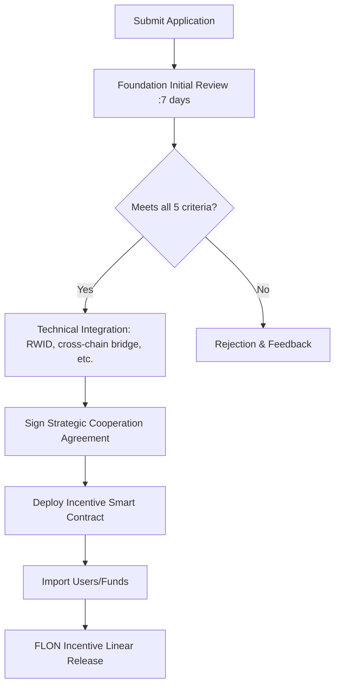

# FullOn Public Chain Ecosystem Strategic Cooperation White Paper

## Version Information

- **Version**: 1.0
- **Release Date**: November 2025
- **Issuing Organization**: FullOn Public Chain Foundation
- **Scope**: FullOn Public Chain and its ecosystem strategic cooperation projects

## Introduction

As a high-performance, decentralized Layer 1 public chain, FullOn Public Chain is dedicated to building an open and interconnected Web3 ecosystem. By strategically partnering with high-quality ecosystem projects, FullOn Public Chain aims to achieve exponential growth in user base, transaction volume, and capital flow. This white paper outlines the selection criteria, empowerment mechanisms, and incentive systems for ecosystem strategic cooperation, with the goal of creating a closed-loop ecosystem of "symbiosis, co-construction, and sharing."

Projects that meet the selection criteria will receive comprehensive support from FullOn Public Chain in technology, traffic, funding, and governance. In return, by contributing users, capital, and technology, these projects will receive long-term incentives in the form of FLON base tokens, achieving mutual value alignment.

---

## I. FullOn Public Chain Foundation Selection Criteria

To ensure the quality and sustainability of ecosystem strategic cooperation, the FullOn Public Chain Foundation has established the following **mandatory entry requirements**:

| No. | Requirement | Specific Criteria |
|-----|------------|------------------|
| 1 | Platform Token | At least 80% of the total platform token supply must be cross-chained or natively issued on the FullOn public chain |
| 2 | Core Application On-Chain | Core business logic (e.g., payment, social, DeFi, GameFi, etc.) must be built on FullOn public chain technology |
| 3 | Integrated RWID Wallet | The project app must integrate FullOn's unique **RWID (Real-World ID) wallet generation technology**, supporting one-click creation of on-chain accounts |
| 4 | Contribution Scale | Expected to contribute to the FullOn ecosystem: • On-chain users ≥ **100,000** • Daily transaction volume ≥ **10 million USD** • On-chain funds ≥ **5 million USD** |
| 5 | Existing User Base | The project must already have ≥ **10,000** active users, with rapid migration capability |

> **Note**: Only projects meeting all five criteria are eligible for the Foundation's review process. The review period will not exceed 14 business days.

---

## II. FullOn Public Chain Empowerment System for Ecosystem Projects

Through strategic partnerships, ecosystem projects will receive the following **seven core empowerments**:

### 1. FLON Incentive Pool (Total: 1.8 billion FLON, 18% of total supply)

- Dedicated to rewarding all strategic ecosystem partner projects
- Dynamically allocated based on contribution until all 1.8 billion FLON are distributed
- Release rule: **4-year linear vesting (T+48 months)**

### 2. RWID Wallet Technology Licensing

- Provides the **RWID Wallet SDK**, enabling project teams to generate FullOn on-chain accounts with a single click within their apps
- Supports **channel number binding**: When users register wallets, the project team's designated account is recorded in on-chain metadata as the basis for subsequent incentive allocation
- Technical support: Complete API documentation, testnet environment, and security audits provided

### 3. Token Issuance and DEX Integration

- Offers **native token issuance services** (on FullOn chain or other EVM-compatible chains)
- Integrates with FullOn ecosystem DEXs (decentralized exchanges)
- Equipped with **Automated Market Making Bot (AMM + Market Maker Bot)** to ensure deep liquidity

### 4. Cross-chain Asset Bridging

- Supports bidirectional atomic cross-chain transfers between major assets (**USDT/USDC/BTC/ETH**) and the FullOn public chain
- Ensures asset security and instant settlement

### 5. Ecosystem User Interconnectivity

- Access to the **FullOn ecosystem user pool**, enabling cross-project user sharing and joint marketing
- Supports **on-chain identity tokens (Soulbound Tokens)**, allowing users to inherit cross-project rights

### 6. Decentralized Social Services

- Provides the **FullOn Social Protocol**, supporting the creation of decentralized social feeds within projects
- Users can publish content on the FullOn chain for cross-project dissemination

### 7. AI Technology Module Integration

- Open access to **FullOn AI Agents**, supporting:
	- On-chain AI inference (text generation, image recognition)
	- Intelligent recommendation engine
	- Anti-fraud risk control models
	- Automated trading

---

## III. How Ecosystem Projects Obtain FLON Incentives

Ecosystem projects can obtain FLON incentives through the following **three methods**, all of which are **released linearly over 4 years**.

### Path 1: Value Injection Incentive (Core Path)

| Contribution Type | Incentive Standard | Release Rules |
|-------------------|-------------------|---------------|
| **1.1 Wallet Registration Users** | • Reward of **100 FLON** per **valid user** • Or select **low incentive mode**: **10 FLON** per user • Valid user: Completes KYC or at least 20 on-chain interactions | 4-year linear release |
| **1.2 Fund Inflow** | Reward of **0.001 USD equivalent in FLON** per **1 USD** (USDT/USDC) inflow (calculated based on the average FLON/USD price of the week) | 4-year linear release |

> **Example Calculation**:
>
> Project brings in 100,000 valid users + 5 million USD in funds
>
> Incentive = 100,000 × 100 FLON + 5,000,000 × 0.001 × FLON price
>
> → Total incentives are distributed linearly over 4 years

### Path 2: Token Swap (Optional, subject to negotiation)

| Project | Details |
|---------|---------|
| **2.1 Lock-up Method** | After an equal-value token swap, both parties' tokens are locked via a FullOn chain smart contract |
| **2.2 Exchange Ratio** | Calculated based on the **private placement price** of both parties |
| **2.3 Release Plan** | Default: **18-month lock-up period** followed by a **4-year linear release** |

> **Example**:
>
> Project A private placement price: $0.10, Project B (FullOn) private placement price: $0.05
>
> → Swap 10 million A tokens ↔ 20 million FLON, locked in the smart contract

### Path 3: Become a Core Validator Node

| Benefit | Details |
|---------|---------|
| **3.1 Eligibility** | Strategic cooperation projects are **pre-qualified to obtain 21 core node election rights** |
| **3.2 Node Rewards** | After deploying a node, projects can participate in: • Network consensus maintenance • Block production • **Node mining rewards (FLON)** |

> Node rewards are independent of ecosystem incentives and are not limited by the 1.8 billion FLON pool

---

## IV. Cooperation Process

---

## V. Risk Warning and Exit Mechanism

1. **Incentive Recovery**: If a project engages in fraud, absconds, or commits serious violations during the cooperation period, the Foundation reserves the right to reclaim any released FLON.
2. **Exit Mechanism**: Either party may withdraw with 30 days' written notice. Any remaining unreleased FLON will automatically become invalid.
3. **Transparent Audit**: All incentive data is on-chain, verifiable, and subject to community oversight.

---

## VI. Contact Information

- **Official Website**: https://fullon.network
- **Email**: ecosystem@fullon.network
- **Telegram**: @flondao

---

**FullOn Public Chain Foundation**

**November 2025**

> **Vision**: To make every high-quality ecosystem project a co-builder and beneficiary of the FullOn ecosystem.
>
> **FLON** — Connecting all chains, empowering all things.
