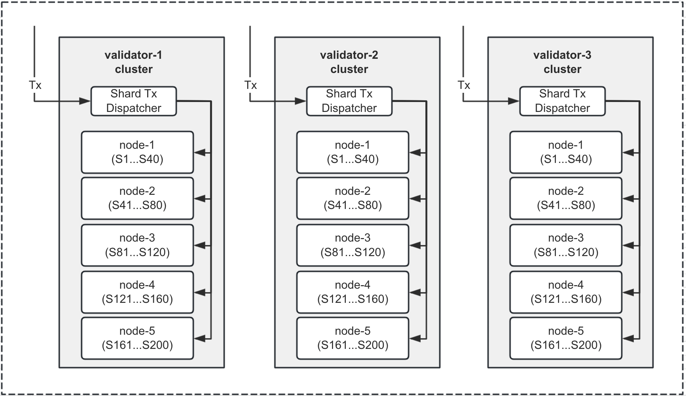

# **FullOn** Protocol White Paper
> Building a Ultra-scalable 2D-Sharding Modularized Layer-1 Blockchain Network

_NOTE: This `v0.3` document is under development. Please check back regularly for updates!_

## Table of Contents

- [01. Abstract](#01-abstract)
- [02. Introduction](#02-introduction)
- [03. Why FullOn](#03-why-FullOn)
   - [Focus use cases](#Focus-use-cases)
   - [Core innovations](#core-innovations)
- [04. Design Principles](#04-design-principles)
- [05. How FullOn Works](#05-how-fullon-works)
   - [Overall architecture](#overall-architecture)
   - [Implementation choice](#implementation-choice)
   - [Key specification](#key-specification)
   - [Key infrastructure](#key-infrastructure)
   - [Key applications](#key-applications)
- [06. Tokenomics](#06-tokenomics)
   - [Token allocation and distribution](#token-allocation-and-distribution)
   - [Inflation](#inflation)
   - [Deflation](#deflation)
- [07. Governance](#07-governance)
- [08. Disclaimer](#08-disclaimer)

# 01. Abstract

**FullOn** is a decentralized application platform that endeavors to not only attack the scalability problem but also provide the best user experience, decentralization and security such that users from around the world can safely and freely participate, collaborate and prospect together within this ever-growing ecosystem. 

As a matter of fact, Bitcoin as the pioneer blockchain can only process `7` transactions per second while Ethereum can support `12 TPS`. With the [EIP-4844](https://www.eip4844.com/) upgrade, the layer-2 solutions to Ethereum could support up to `1500 TPS`, which is still far from optimal. While many other blockchain are claimed to have achieved about `10K TPS` or even million-level TPS, they are primarily centralized and require rather powerful hardware to meet the scalability requirement. 

By applying an innovative two-dimension (2D) sharding technique, **FullOn** is set to break the performance and scalability bottleneck that has been plaguing the contemporary blockchain industry for a long time. As the name suggests, **FullOn** is able to fully utilize computing resources from network validators with modern computer hardware and scale both vertically and horizontally without sacrificing decentralization and security.

# 02. Introduction

The world is now standing at the brink of the web3 era in which major economic and financial activities could entirely happen within a blockchain-powered technology environment. Apart from launching blockchain networks and issuing cryptocurrencies that can be invested or speculated by crypto fans amongst themselves, it has been rigorously sought by many industry pioneers to tokenize and issue real-world assets on-chain, which would certainly open up an infinite amount of opportunities to rejuvenate the world economy. It has been projected by some large financial firms like Citi bank that by 2035 the real-world assets to be issued on-chain would amount to `$4 trillion` in value. By contrast, the global crypto market capital has surpassed `$2.64 trillion` as of written and will certainly grow much larger and faster. Blockchain technology and cryptocurrencies have been not only embraced by many early brave individuals but also recent financial institutions from around the globe.

However, in order for blockchain technology to be widely adopted, one well-known problem called blockchain trilemma has yet to be overcome, i.e. only 2 out of the 3 critical aspects of blockchain technology can be simultaneously met: security, scalability, and decentralization. As a result,  most blockchain networks are left with no choice but to prioritize security and decentralization over scalability at the cost of achieving very limited throughput in terms of transaction per second (TPS) and rather large latency for each block to be produced and finalized on-chain, not to mention paying gas fees for submitting each transaction as adopted by most blockchain in fighting against junk messages. Therefore it can be rather daunting for users coming from the web2 technology world to fully embrace blockchain. Furthermore certain applications like high-frequency trading are simply not viable with most layer-1 blockchains. Thus, people resort to layer-2 solutions that however lack the critical decentralization property and require rather lengthy duration (E.g. usually one week) for users' assets to be eventually settled back into the layer-1 network, which can be a showstopper for many applications to adopt. Other solutions try to modularize the blockchain into data, settlement and execution layers in order to tackle the trilemma problem but still cannot meet the scalability requirement due to the execution layer itself not being sufficiently optimized.

Therefore, much needed and expected is for a layer-1 protocol that can break the blockchain trilemma by ensuring decentralization and security aspects as well as achieving a scalability level that can support a wide range of applications including those requiring low-latency and high-throughput.

# 03. Why FullOn

Compared with other blockchain protocols, **FullOn** has the single most important goal to achieve, which is to solve the scalability problem in order to bring the whole world into the web3 era. Secondly **FullOn** will take on the data availability problem by encouraging/incentivizing vastly distributed lightweight nodes around the globe that synchronize with the main network nodes.

## Focus use cases

As a decentralization application platform, **FullOn** can certainly support a wide range of DAPPs as experienced in any other blockchains today. Most of the DAPPs are in the category of low-to-middle frequency in invocation like once a minute or so and do not have a need for second or sub-second level latency for transactions to be effective on-chain. However, there are other types of applications that require high-frequency and low-latency in execution.

**FullOn** has been long awaited for fulfilling the demand of **high-frequency low-latency order-book based decentralized exchange (DEX)** applications in order to compete against the centralized exchanges in terms of usability, performance and the total number of trading markets. As of today, unfortunately for the blockchain world, there exists virtually none such decentralized platform that can offer the similar if not the same user experience as witnessed with centralized crypto exchanges. 

## Core innovations

### 1. Scalability innovation

**FullOn** has come up with a grand way that answers the scalability challenge by adopting both scale-up and scale-out 2D sharding technique for the fullest parallel execution to achieve the highest possible throughput. Scale-up means adding more hardware resources to a single node computer while scale-out means adding more nodes to form a cluster for a block producer.

With the 2D sharding approach, **FullOn** could achieve a virtually infinite degree of scalability with two dimensions of sharding: a) node level; b) cluster level. The total throughput would be a value of (N * M) , in which N stands for number of nodes per cluster for individual blocker producer’s environment and M for the usable number of CPU cores for blockchain transaction execution within a single node.

As **FullOn** supports `5000+ TPS` per shard, the following is the TPS projection table by different combinations of M & N.

| N (Cluster Size) | M (No. of Shards) | Total TPS |
|------------------|-------------------|-----------|
| 1                | 1                 | 5K        |
| 1                | 4                 | 20 K      |
| 1                | 8                 | 40 K      |
| 1                | 16                | 80 K      |
| 1                | 32                | 160 K     |
| 1                | 100               | 500 K     |
| 1                | 200               | **1 M**   |
| 4                | 64                | 320 K     |
| 4                | 128               | 640 K     |
| 4                | 400               | **2 M**   |

As exhibited in the above table, even without employing the clustering technology for the block producers, simply by scaling up, i.e. adding more CPU cores can achieve a very handsome size of TPS and beat most other blockchains existing today. The clustering technology to be applied is only necessary when the single-node scaling configuration is not able to meet the TPS demand. It is however up to individual block producers to decide whether or not the clustering or scaling-out approach shall be adopted.

There are however several limiting factors like network bandwidth, disk I/O speed and CPU core number that would collectively affect the TPS outcome of this 2D sharding technique. The plan is to optimize around these factors so as to achieve a continuous growth of scalability as the value of M & N increases. It is very much technically elegant to implement. 

Furthermore, unlike many other blockchain sharding protocols that apply sharding from network, execution and state levels, **FullOn** believes in the simplicity design philosophy by applying sharding only at execution and state level to reduce the complexity of cross-shard communications. More details about 2D sharding will be provided in the section of How **FullOn** Works.

### 2. Dual-chain innovation

Instead of providing a single chain to handle consenus, execution, settlement and data availability etc. core protocol tasks, `FullOn` protocol chooses to segregate the duties by providing two chains, i.e.: `Transaction Execution Chain` for consensus, execution and settlement and `Data Availability Chain` for maximizing data availability. Only through this design can scalability and decentralization be achieved meanwhile not sacrificing security at all!

# 04. Design Principles

Both the design and development of the **FullOn** platform are guided by a handful of key principles.  These principles reflect the problems inherent in both the centralized and decentralized systems of today.

1. **Usability:** Applications deployed to the platform should be seamless to use for end users and seamless to create for developers.  Wherever possible, the underlying technology itself should fade to the background or be hidden completely from end users.  Wherever possible, developers should use familiar languages and patterns during the development process. Basic applications should be intuitive and simple to create while more robust applications should still be secure.
2. **Scalability:** The platform should scale with no upper limit as long as there is economic justification for doing so in order to support enterprise-grade, globally-used applications.
3. **Affordability:** As **FullOn** is set to be an application platform instead of just being a store of value, it must make sure the cost of using the network is relatively affordable by the majority of users.
4. **Simplicity:** The design of each of the system’s components should be as simple as possible in order to achieve their primary purpose. 
5. **Sustainable decentralization:** The platform should encourage significant decentralization both in the short term and the long term in order to properly secure the value it hosts. The platform and community should be widely and permission-lessly inclusive and actively encourage decentralization and participation. To maintain sustainability, both technological and community governance mechanisms should allow for practical iteration while avoiding capture by any single parties in the long run.
6. **Upgradability:** The protocol should be easy to upgrade once the mainnet network has been launched. It would be ideal not to change the node software in order to upgrade the system configurations or even protocol-level logic.
7. **Modularity & Extensibility:** The overall system software shall be well organized by clean-cut modules, each of which can be easily swapped out and replaced with new ones for customizability and extensibility.

Last but not least, it is expected that regardless of the underlying technological implementations and protocol specifications, the above design principles must be strictly adhered to unless otherwise revised within this paper.

# 05. How FullOn Works
## Overall architecture

**FullOn** protocol adopts a unique dual-chain model as shown in the following architecture diagram.

**FullOn** Transaction Execution Chain (`TEC`) provides a highly scalable and performant application platform for the entire ecosystem whereas **FullOn** Data Availability Chain (`DAC`) synchronizes all transactions from `TEC` chain and incentivizes deployment of as many `DAC` nodes as possible to form the whole `DAC` network around the globe in order to achieve the maximum level of distribution and anti-censorship. In addition, the **FullOn** `DAC` nodes provide access to the `TEC` P2P network.

**FullOn** `TEC` network has following unique set of characteristics:

- **Zero gas fees:** thanks to the adoption of resource staking model, users do not need to pay gas fees during each transaction submission, which greatly reduces user’s operational cost while retaining the ability to counter dusting attacks. Once the TEC network mining has been exhausted, i.e. no further new coins to mine, gas fees will be charged for each on-chain submission but the price will be pegged with USD fiat currency through DAO governance voting processes such that relatively low gas fees will be charged for further flourishment of the ecosystem. 
- **Abstract account:** a user’s account is no longer bound to a single set of private and public keys as usually seen in most contemporary blockchain networks. Instead, one can have a hierarchical set of permissions under each account and each permission can be bound with either another account or corresponding set of private and public keys. This new model also allows users to define their personal account names and opens doors to an infinite set of application usages.
- **Sharding & clustering:** this is the most critical piece of this protocol by tackling the scalability problem through sharding and clustering techniques which will be covered in great detail in following sections.
- **Dual-VM:** both WASM and EVM as the smart contract platforms will be supported in a single network in order to gain developers from both camps.
- **DPoS consensus & mining:** through the continuous on-chain election process, network validators are elected to maintain the whole TEC network and also get rewarded with newly mined tokens for their work.
- **Instant finality:** with this feature can applications become aware in a timely fashion (`~1.5 sec`) that their transactions submitted onto the network have been finalized on-chain.

**FullOn** `DAC` network has following unique set of characteristics:
- **TEC P2P forwarding:** for transactions submitted onto `TEC` network can be sent to a `DAC` node first which can forward it onto the `TEC` P2P network. This 
- **Light & fast data sync:** As there requires no execution but synchronization of transactions recorded from `TEC` network, each `DAC` node can be light and fast in processing the data sync job  and it is expected even mobile phones or browser plugin with large storage can be used to accomplish this task such that virtually all users could participate in this `DAC` network.
- **Data availability proof verification:** data recorded onto the `DAC` network can be verified for existence and validity to prevent cheating.
- **POS consensus & mining:** `DAC` network adopts POS consensus algorithm and validators are rewarded for their work in keeping synchronized with the TEC network.

**FullOn** `TEC` network will be first launched and `DAC` network will be launched subsequently once the data availability proof verification technology matures.

## Implementation choice

As the whole blockchain industry has been maturing, it does not make sense to reinvent the wheel for most common building blocks like peer-to-peer distributed systems, consensus algorithms and virtual machines to host execution of smart contracts. After reviewing many existing open source blockchain software, the core development team made a decision to build the core unique features based on the latest version of [Antelope Leap](https://github.com/AntelopeIO/leap) (formerly known as `EOSIO`) for its modular architecture design, superb performance and extensibility. **FullOn** embraces the open source software model and will collaboratively evolve the code with developers from around the world. 

However, as **FullOn** is a set of protocol specifications and means to be implementation neutral if possible, it can leverage implementation of other existing blockchains or can be rewritten from scratch with different programming languages. 

## Key specification

Following table provides the key technological specifications of the protocol:
| Attribute               | Value           | Description                                                   |
|-------------------------|-----------------|---------------------------------------------------------------|
| Block interval          | `1 sec`         | A subtle choice made between low latency and high reliability |
| Instant finality        | `1.5 sec`       | desired by apps to counter double-spending etc attacks        |
| TPS per Shard           | `5000`          | Measured against token transfer transactions                  |
| `TEC` Consensus         | `DPoS`          | Invalid transactions get rejected by validator nodes          |
| `DAC` Consensus         | `POS`           | Every transactions recorded on the TEC network will be also kept in DAC network |
| Dual-VM                 | WASM & EVM      | Dual virtual machine support out-of-the-box                   |
| Native token            | `$FLON`         |  Maximum supply: `1 billion`                                  |
| Account abstraction     | Native support  | Accounts binding with key or account-based permissions        |
| Gas fee                 | zero before FLON gets fully mined | Resource model based, to avoid front-running trading & MEV issues |
| Anti-sybil attack       | CPU/Net/RAM resource usage control | Staking native token to get system resources required for on-chain activities |

## Key design

### Dual-chain design

**FullOn** network is composed of two chains or subnetworks, one being the transaction execution chain (or `TEC` Chain) whereas the other being the data availability chain (or `DAC` Chain). The `TEC` chain is also responsible for arriving at consensus amongst all participants. Consensus for blockchain means ordering of transactions while execution handles the states of the underlying distributed ledgers. Data availability means the accessibility of the blockchain data such that more up-to-date copies of the same data are more robust in countering any potential attack to the entire network and ensure timely recovery and survival of the network even under certain extreme circumstances.

This structure is made out of a modular blockchain design such that the blockchain trilemma (scalability, security and decentralization) can be finally tackled.

**FullOn** `TEC` chain serves as the decentralized application platform to host all kinds of DAPPs and is operated and governed by up to 101 validators who are elected through a constant voting process (21 of them are the executing members while the rest 80 nodes operate in a standby mode to serve as backup or wait to be elected into the top 21 members list)

**FullOn** DAC chain being light and fast is poised to provide the last-mile connectivity to up to 8 billion users worldwide. `DAC` nodes can run inside mobile devices or browser plugins as long as they satisfy the storage requirement for keeping the `TEC` data. As a result of adopting the POS consensus algorithm, there will be no hard limit for the total number of validators maintaining the `DAC` network. Furthermore, `DAC` validator nodes not only relay or forward transactions to the TEC network but also construct transactions for DAC block signing.

In terms of the network launch, the initial network would be TEC chain only and then DAC chain will be added into the network when the data availability proof technology has become mature and efficient for small footprint devices to power the `DAC` network.

### 2D-sharding design

TEC chain serves as a decentralized application platform and must be scalable to support the increasing workload as more and more users are joining and playing on the platform. Many other chains including Ethereum choose to increase the gas fee price to limit users from accessing the network to alleviate the network congestion problem.

In order to fully address this scalability issue, **FullOn** came up with an innovative 2D-sharding scheme by scaling up vertically and scaling out horizontally.
 
1. **Scale-up : sharding by cores**

Modern computers are by default multi-core based and can support many worker threads running in parallel. However, blockchain transactions are ordered and usually executed in a sequential manner, failing to leverage the exuberant number of CPU cores. There have been some efforts in existing blockchain protocols trying to make the transaction execution parallel even though the transactions come in sequential order and may be dependent between themselves. Sharding is a common technique adopted by many protocol designers. However, most of the protocols choose to apply sharding at network level, i.e. segmenting the entire network into sharded subnetworks. This approach has side-effects like adding too much cross-shard communication overhead and weakening the consensus by splitting the single chain into multiple sub-chains.

**FullOn** comes up with a different approach by maintaining a single chain while sharding the transactions by their pre-designated shards such that the execution will be conducted in different shards running in parallel and their states will be also maintained separately within each shard. That means each transaction will be tagged with a unique shard name which will be decided by the application providers. In addition, the shard names must be registered in advance with the very first shard or the base shard. All validators must execute all shards to ensure each shard is validated and executed appropriately. 

Following is the diagram of how a network validator produces a new block by picking up transactions from the mempool and dispatching them into different shards for parallel execution and state updating.

More details including cross-shard communication etc can be covered in the low-level design of **FullOn** sharding technique.

The design of scale-up sharding certainly would hit an upper limit which is the maximum number of CPU cores that a node can have. Usually with more CPU cores it becomes much more expensive. Hence, scaling up certainly has the potential technological and economic bottleneck. Furthermore, memory and disk I/O can not scale up accordingly as the total number of CPU cores grows. Let’s take 40 as the maximum number of CPU cores a node can have for scale-up sharding with 5000 TPS per shard, the total TPS would be: 
> 40 * 5K = 200K TPS

2. **Scale-out: sharding by nodes**

Since it is not possible to scale up infinitely, it is still possible to scale out by adding nodes to form a cluster for each block producer such that more TPS could be achieved. Say each block producer has 5 nodes an each node can support 200 K TPS, then the total TPS the entire network could achieve will be:
> 5 * 200K = 1M TPS

Following diagram shows the setup for a validator cluster that can achieve a million TPS. Each validator runs a node dispatcher that listens to the `TEC` P2P network as well as opens its RPC port to receive new transactions and dispatch them to each of the five nodes within the cluster in a round-robin fashion. Each node has a pre-configured unique number as the node ID and can receive only the transactions that are associated with the node ID. The mapping of transactions to the node ID can be done in a naive manner by converting Shard ID (ShID) into a hash value to derive the modulo of the total number of cluster nodes.

## Key infrastructure

In order to make a blockchain ecosystem a success, applications like blockchain explorer or scanner, self-custody wallets, faucet token claiming tool and universal cross-chain bridge,...etc must be all available right after the launch of the network. The **FullOn** core team will provide these infrastructural components and also open source them to let community developers evolve them to cater for future needs.

## Key applications

**FullOn**’s unique sharding technology allows it to host DAPPs that typify high-frequency on-chain activities like order-book based DEXes offering about maximum 5K trading pairs as usually supported in CEXs. If on average each trading pair requires 10 TPS, the total demand would be 50K TPS. This is not a small feat for most blockchains to achieve. Instead, many so-called DEXes  choose to provide a decentralized frontend but with a centralized backend to process the trades. Other DEXes are clones of UniSwap which offers an optimal user experience for newcomers or retail traders.

**FullOn**’s topmost goal is simple, which is to become the decentralization platform of choice to host the world’s largest and fastest DEXes to rightfully compete against CEXes with a similar if not the same level of user experience while having all the beauty of being decentralized.

Following gives a quick comparison of DEXs run on FullOn and other blockchain platforms.

| DEX function   | **FullOn**-powered DEXes | Other DEXes |
|----------------|------------------------|-------------|
| Order booking  | On-chain               | Off-chain   |
| Order matching | On-chain               | Off-chain   | 
| Order settlement| On-chain              | On-chain    |

It is in the core team’s belief that only through offering the full decentralization can the following benefits be achieved:
   1. Low maintenance, reducing the total operational cost at least by 10x compared to CEXes.
   1. Faster development pace by focusing on smart contract code mainly
   1. Protocol DAO members decide how it evolves
   1. Users have their sole control to their assets traded on-chain
   1. Truly 24x7 working hours

Last but not least, most mission-critical web2 applications that demand high throughput and fast response (low-latency) can also be easily transformed into FullOn DAPPs, which are usually not possible with other decentralization protocols.

# 06. Tokenomics

## Token allocation and distribution

The maximum supply for **FullOn**’s native token `$FLON` is `1 billion`. However, there will be only `800,000,000 FLON` tokens to be first issued at the Genesis launch of **FullOn**’s mainnet and the remaining `200,000,000 FLON` tokens will need to be mined by `TEC` and `DAC` network validators or miners. The newly issued tokens will be allocated in the following way, where each category is described in greater detail in the following sections:

Below gives the table of the allocation plan with corresponding lockup schedules:
| Allocation Category  | Allocation Rate     | Amount              | Initial Holding Account | Lockup Schedule                  |
|----------------------|---------------------|---------------------|-------------------------|----------------------------------|
| Early Ecosystem      | `10%`               | `100,000,000`       | `flon.dao`              | 1-year cliff, 4-year max lockup  |
| Community Presale    | `18%`               | `100,000,000`       | `flon.dao`              | 6-month cliff, 2-year lockup     |
| Fundraising          | `18%`               | `180,000,000`       | `flon.dao`              | 6-month cliff, 3-year lockup     |
| Foundation Endowment | `10%`               | `300,000,000`       | `flon.fund`             | Governed by DAO                  |
| Core Contributors    | `12%`               | `120,000,000`       | `flon.coredev`          | 1-year cliff, 4-year lockup      |
| Community Grants/Programs | `12%`          | `120,000,000`       | `flon.ecodev`           | 1-year cliff, 5-year lockup      | 
| TEC Mining Reserve   | `10%`               | `200,000,000`       | N/A                     | N/A                              |
| DAC Mining Reserve   | `10%`               | `200,000,000`       | N/A                     | N/A                              |

_NOTE: Unlocking for the lockup tokens happens in a linear, per-block fashion._

## Allocation Detail

### Early Ecosystem

There are `10%` of the total supply, i.e. `100,000,000 FLON` tokens allocated in this category. 

Early Ecosystem includes all of the grants for those who have participated in the ecosystem at the early stages. A large portion of tokens is devoted to grants and programs which fund community efforts, community projects and community-built technical components. This spans everything from education to events to direct deployment of the early network as well as some key applications that attract users and capital into this network. A small provision exists for community awareness and brand development through community airdrops to those crypto fans from various communities.

Lockups for these efforts are typically 6- or 48-months, though a handful have been shorter or longer. It also includes allocations for several programs that haven’t launched yet. Those who participate in the early community efforts by completing certain promotional tasks will be rewarded with airdrops of tokens up to 1% of the total supply and their tokens will be locked for 6 months.

### Community Pre-Sale

There are `10%` of the total supply, i.e. `100,000,000 FLON` tokens allocated in this category. 

The network at scale will be fully community-driven and that requires making sure the community has the tokens they need. The Community Pre-Sale is set to start in `May 2024` in multiple rounds with incentives for the early participants and rewards for the promoters. The proceeds of the sale will be solely used for funding the core team in development of the protocol as well as listing the tokens in some top exchanges in the world. All of the tokens sold to the community will be subject to 2-year linear lockups with 6-month cliff after the mainnet launch. 

### Fundraising

There are `18% `of the total supply, i.e. `180,000,000 FLON` tokens allocated in this category. **FullOn** raises from backers that can meet following conditions:

1. Long-term success oriented
1. Able to add value to both the project (E.g. via actively supporting the team) and the network (E.g. via validating or delegating stake).
1. No single player should control an undue amount of stake

The backers have the 3-year lockup with a 6-month cliff after their investment.

### Core Contributors

There are `12%` of the total supply, i.e. `120,000,000 FLON` tokens allocated in this category. 

**FullOn**'s core team is composed of not only top-notch blockchain developers but also seasoned crypto leaders that have gone through ups and downs of many crypto market cycles. Core team members have been important in the early success of the protocol and they are incentivized to remain active with its development for a long time afterwards. It is also open for new industry leaders to join the team to help with the long-term and strategic growth of the network and ecosystem.

Every single member has the identical 4-year lockup with a 12-month cliff after the mainnet launch.

### Foundation Endowment

There are `30%` of the total supply, i.e. `180,000,000 FLON` tokens allocated in this category. 

The **FullOn** Foundation stood up the initial network nodes and spun them down to focus on coordinating the governance of the ecosystem, funding projects and kicking off remaining distribution activities. The Endowment represents a pool of tokens which are meant to support the Foundation’s operations in the long term and which might be deployed in a wide range of ways.
This endowment is split into 2 pieces. The first half, which is not locked up, will likely be deployed across multiple strategies to help ensure the network operates smoothly during its early phases. The second half is subject to a 24 month linear lockup since it is not expected to be accessed during the early days beyond delegation to support decentralization. Both tranches are meant to be deployed in ways which preserve principle wherever possible to ensure long-term availability rather than systematically sold for short-term capital.
As part of the initial rollout, the Foundation accounts will be setting up the lockups and accounts for the rest of holders. Some tokens may still be in these accounts during rollout if recipients are delayed in setting up their respective custody solutions.

### Community Grants and Programs

There are `12%` of the total supply, i.e. `120,000,000 FLON` tokens allocated in this category. 

A large portion of tokens is devoted to grants and programs which fund community efforts, community projects and community-built technical components. This spans everything from education to events to direct deployment into venture-style funding for projects. A small provision exists for tokens that can be given away or sold in the future. Because %these efforts are decidedly long-term in nature, the tokens are released over 60 months.

### Mining Reserve for TEC and DAC

There are `20%` of the total supply, i.e. `200,000,000 FLON` tokens allocated in this category. 

The **FullOn** ecosystem must ensure incentives exist for all types of miners (E.g. `TEC` miners, `DAC` miners, connectivity miners and including future unknown types of miners) to support a robust network and ecosystem. In order to ensure sufficient incentive for the layer-1 network, the execution miners are allocated in total 100,000,000 FLON tokens, to be mined within 10 years: each of the first 2 years will have `20%` of the allocation, i.e. `20 million FLON` and each of the following 6 years will have `10%` of the allocation, i.e. `10 million FLON`. The remaining `100,000,000 FLON` tokens will be allocated to `DAC` miners, connectivity miners and future introduced miners. 

It will be up to the community DAO governance committee to determine in the future how to distribute those tokens, through **FullOn** improvement proposals (`FIPs`) or similar decentralized decision making processes. As years pass and the network evolves, it will be up to the community to decide whether this reserve is enough, or whether to make adjustments with unmined tokens.

## Inflation

By default there will be no plan of inflation of the total supply except mining for new tokens within the minng reserve allocation. However, when necessary, especially after exchausting the mining reserve, it may be decied by the FullOn DAO governance body to inflate the supply to meet the new enviornment demands.

## Deflation

`$FLON` as the native token to **FullOn** protocol will be continuously used/consumed in unlimited ways, including activities like staking FLON tokens for getting on-chain usage resources and voting power for validator election…etc. However, most of the activities only result in FLON tokens being locked for a while, which creates merely a temporarily deflation effect. 

To make `$FLON` to be more valuable to hold, there will be actual deflation forces to be created to continously decrease the total supply of FLON tokens. Following are just two examples of the forces:

**FullOn** as a web3 platform empowers mission-critical decentralized application and services. DAPPs especially those who received **FullOn**’s capital support are encouraged to allocate aside at least 20% their services fees to buyback and burn `$FLON` tokens to create the deflation effect. That means more DAPPs to be deployed and used, more `$FLON` tokens are to be burnt.
After the mining reserve has been exhausted, gas fees will be charged for each transaction to be submitted on-chain and 50% of the gas fees in the form of `$FLON` tokens will be burnt and the rest 50% goes to the miners (the percentage for burning can be modified throught DAO governance) .

# 07. Governance

Like many other blockchain projects, **FullOn** started as a centrally governed project both from technological and economic perspectives. As the project gets into later stages, **FullOn** will be governed by decentralized autonomous organization or DAO and become fully decentralized.

Following diagram shows the standing committees within the **FullOn** `DAO` and the voting based governance process:

There can be many other DAOs existing within the ecosystem like social DAO, developer DAO, DeFi DAO, ...etc. that they conduct their own soverign governance within their own domain. Whenever there is a need for address issues crossing community or ecosystem DAOs, **FullOn** `DAO` would be thus involved for final resolution.

# 08. Disclaimer

PLEASE READ THE ENTIRETY OF THIS "DISCLAIMER” SECTION CAREFULLY. NOTHING HEREIN CONSTITUTES LEGAL, FINANCIAL, BUSINESS OR TAX ADVICE AND YOU SHOULD CONSULT YOUR OWN LEGAL, FINANCIAL, TAX OR OTHER PROFESSIONAL ADVISOR(S) BEFORE ENGAGING IN ANY ACTIVITY IN CONNECTION HEREWITH. NEITHER FULLON LABS OR FULLON FOUNDATION (THE FOUNDATION), ANY OF THE PROJECT TEAM MEMBERS (THE FULLON TEAM) WHO HAVE WORKED ON THE FULLON PLATFORM (AS DEFINED HEREIN) OR PROJECT TO DEVELOP THE FULLON PLATFORM IN ANY WAY WHATSOEVER, ANY DISTRIBUTOR/VENDOR OF FULLON TOKENS (THE DISTRIBUTOR), NOR ANY SERVICE PROVIDER SHALL BE LIABLE FOR ANY KIND OF DIRECT OR INDIRECT DAMAGE OR LOSS WHATSOEVER WHICH YOU MAY SUFFER IN CONNECTION WITH ACCESSING THIS WHITEPAPER, THE WEBSITE AT HTTPS://fullon.network/ (THE WEBSITE) OR ANY OTHER WEBSITES OR MATERIALS PUBLISHED BY THE FOUNDATION.

PLEASE READ [NOTICE AND DISCLAIMER](fullon.disclaimer.md) FOR DETAILS.

[Back To Top](#table-of-contents)

