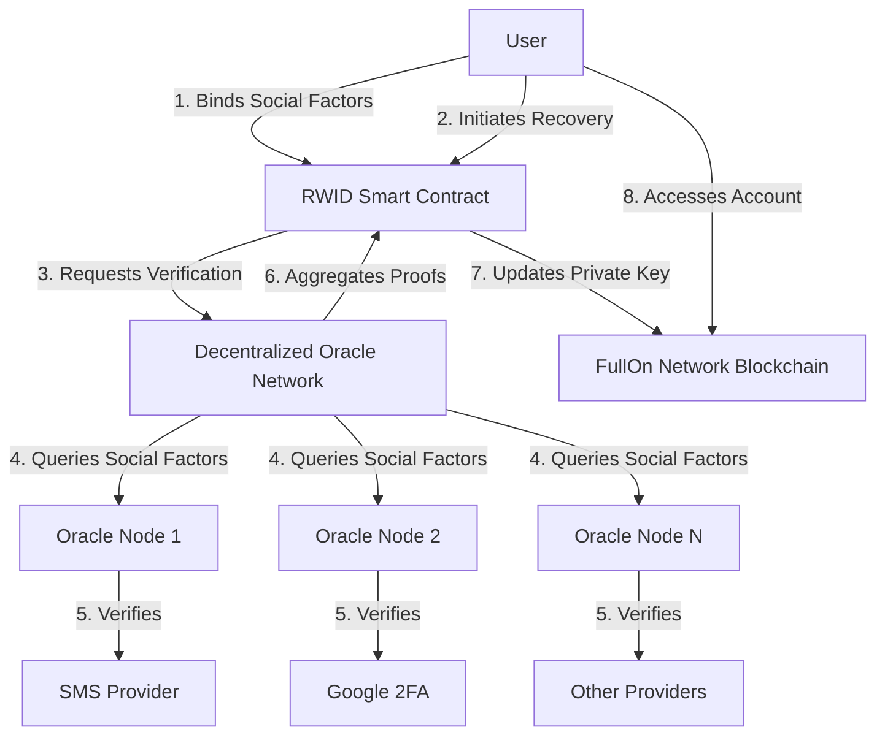

# Real-World Identity (RWID) System with Decentralized Oracles: Secure and Trustless Account Recovery for FullOn Network

## Introduction

The Real-World Identity (RWID) system on the FullOn Network enhances Web3 account security by binding real-world social factors—such as mobile phone numbers, email addresses, Google accounts, WhatsApp IDs, or Telegram IDs—to on-chain accounts, creating RWID accounts. To further align with the principles of decentralization, this design incorporates **decentralized social factor oracles** to eliminate reliance on centralized verification services during the recovery process. This ensures a fully trustless, secure, and user-controlled account recovery mechanism while maintaining usability and robust security.

## RWID System Overview

The RWID system enables users to recover their on-chain accounts in the event of a lost private key by leveraging verified social factors. By integrating decentralized oracles, the system ensures that no single party controls the verification process, preserving the decentralized ethos of Web3. Users can bind multiple social factors to their accounts and set customizable recovery thresholds, with verification handled by a network of independent oracles.

### Key Features
- **Multi-Factor Binding**: Users bind multiple social factors (e.g., mobile phone, Google account, Telegram ID) to their RWID account.
- **Flexible Recovery Threshold**: Recovery requires a user-defined number of verified social factors (e.g., 2-of-3 or 3-of-5).
- **Decentralized Oracle Verification**: A network of decentralized oracles verifies social factor ownership, ensuring no centralized control.
- **On-Chain Smart Contracts**: RWID smart contracts manage binding, verification, and key replacement logic on the FullOn Network.
- **User-Driven Customization**: Users configure social factors and recovery thresholds during account setup.
- **Privacy-Preserving Design**: Social factor data is hashed on-chain to protect user privacy.

## Architecture

The RWID system with decentralized oracles integrates off-chain social factor verification with on-chain account management, using a distributed network of oracles to validate user identities. Below is the updated architecture diagram.

### Architecture Diagram

### Component Breakdown
1. **User**: Interacts with the FullOn Network via a wallet interface to bind social factors and initiate recovery.
2. **RWID Smart Contract**: Deployed on the FullOn Network, it manages social factor binding, recovery thresholds, and key replacement logic.
3. **Decentralized Oracle Network**: A distributed network of independent oracles that verifies social factor ownership and aggregates results.
4. **Oracle Nodes**: Individual nodes in the oracle network that interface with external providers (e.g., SMS, Google 2FA) to validate social factors.
5. **External Providers**: Off-chain services (e.g., SMS providers, Google OAuth) used by oracles to verify user identity.
6. **FullOn Network Blockchain**: The underlying blockchain hosting RWID accounts and smart contracts, ensuring immutability and transparency.

## Decentralized Oracle Network

The decentralized oracle network is the cornerstone of trustless verification in the RWID system. It eliminates reliance on centralized verification services by distributing the verification process across multiple independent nodes.

### Oracle Network Design
- **Node Selection**: The RWID smart contract selects a subset of oracle nodes (e.g., 5 nodes) using a randomized, reputation-based algorithm to prevent collusion.
- **Verification Process**:
  - Each oracle node independently queries the relevant external provider (e.g., SMS provider, Google 2FA) to verify the user’s social factor.
  - Nodes return cryptographic proofs (e.g., signed attestations) to the oracle network.
- **Consensus Mechanism**: The oracle network aggregates responses and uses a consensus protocol (e.g., majority voting or threshold signatures) to determine the validity of the verification.
- **Proof Submission**: The oracle network submits a single, aggregated proof to the RWID smart contract, ensuring efficiency and minimizing on-chain costs.
- **Incentive Structure**: Oracle nodes are incentivized through native tokens or gas fee reimbursements for honest and timely verification. Malicious or unresponsive nodes are penalized through reputation scores or slashing mechanisms.
- **Redundancy**: Multiple oracles verify each social factor to mitigate risks of node failure or compromise.

### Benefits of Decentralized Oracles
- **No Single Point of Failure**: Distributing verification across multiple nodes eliminates centralized control and reduces attack vectors.
- **Enhanced Security**: Consensus-based verification ensures that no single malicious oracle can compromise the recovery process.
- **Transparency**: All oracle interactions are logged and auditable, aligning with blockchain principles.
- **Scalability**: The oracle network can scale by onboarding additional nodes as the FullOn Network grows.

## Workflow

The RWID system operates through two primary workflows: **Account Setup** and **Account Recovery**, now enhanced with decentralized oracle verification.

### Account Setup Workflow
1. **Initialization**: The user creates a FullOn Network account with a private-public key pair.
2. **Social Factor Binding**:
   - The user selects social factors (e.g., mobile phone, Google account, Telegram ID) to bind to their RWID account.
   - The RWID smart contract requests the decentralized oracle network to generate unique challenges for each social factor.
   - Oracle nodes interface with external providers (e.g., SMS provider, Google OAuth) to verify user ownership.
   - Verified proofs are hashed and stored on-chain in the RWID smart contract.
3. **Threshold Configuration**: The user specifies the recovery threshold (e.g., 2-of-3 social factors) required for account recovery.
4. **Confirmation**: The smart contract finalizes the binding, linking the social factors to the user’s on-chain account.

### Account Recovery Workflow
1. **Recovery Initiation**: The user, having lost their private key, initiates recovery via the wallet interface.
2. **Social Factor Verification**:
   - The RWID smart contract requests the decentralized oracle network to verify the user’s social factors.
   - The oracle network selects a subset of nodes to perform verification.
   - Each selected node queries the relevant external provider (e.g., SMS code, Google 2FA) and returns a cryptographic proof.
   - The oracle network aggregates proofs and reaches consensus on their validity.
   - A single aggregated proof is submitted to the RWID smart contract.
3. **Threshold Validation**: The smart contract checks if the user has satisfied the recovery threshold (e.g., 2-of-3 verifications).
4. **Key Replacement**:
   - Upon successful verification, the smart contract generates a new private-public key pair locally for the user.
   - The old key is invalidated, and the new key is associated with the RWID account on-chain.
5. **Account Access**: The user regains access to their account using the new private key.

## Security Considerations

- **Decentralized Verification**: The oracle network’s consensus mechanism ensures that no single node can manipulate the recovery process.
- **Cryptographic Proofs**: All verifications are backed by cryptographic signatures, ensuring authenticity and integrity.
- **Privacy Protection**: Social factor data is hashed on-chain, and oracles only receive minimal data necessary for verification.
- **Collusion Resistance**: Randomized node selection and reputation-based incentives deter malicious behavior.
- **Rate Limiting**: Oracle nodes implement rate limiting to prevent brute-force attacks on social factor verifications.
- **Auditability**: All oracle interactions and smart contract executions are recorded on-chain for transparency.
- **Fallback Mechanisms**: Users can update or rebind social factors if one becomes compromised, with verification handled by the oracle network.

## Benefits

- **Fully Decentralized Recovery**: Eliminates reliance on centralized providers, aligning with Web3’s trustless ethos.
- **Robust Security**: Decentralized oracles and threshold-based recovery mitigate risks of unauthorized access.
- **User-Friendly Design**: Simplifies account recovery for non-technical users, enhancing Web3 adoption.
- **Customizable Flexibility**: Users can tailor social factors and recovery thresholds to their preferences.
- **Scalable Architecture**: The oracle network can handle increasing demand as the FullOn Network grows.

## Future Enhancements

- **Expanded Oracle Ecosystem**: Support for additional decentralized oracle providers to enhance redundancy and resilience.
- **Integration with DID Protocols**: Incorporate decentralized identity (DID) standards for advanced social factor verification.
- **Biometric Oracles**: Develop oracle nodes capable of verifying biometric data (e.g., facial recognition) in a privacy-preserving manner.
- **Cross-Chain Support**: Extend RWID and its oracle network to other blockchains for interoperability.
- **Gas Optimization**: Leverage layer-2 solutions to reduce costs for oracle interactions and on-chain recovery.

## Conclusion

The RWID system with decentralized oracles represents a groundbreaking approach to Web3 account recovery, combining the accessibility of real-world social factors with the security and trustlessness of blockchain technology. By integrating a decentralized oracle network, the FullOn Network ensures that no single party controls the recovery process, delivering a secure, scalable, and user-centric solution. This design sets a new benchmark for account recovery in the Web3 ecosystem, empowering users to engage with blockchain technology confidently and securely.
