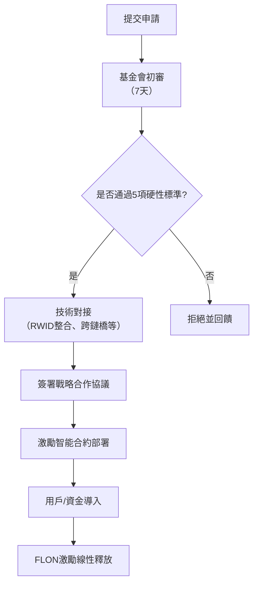

# FullOn公鏈生態策略合作白皮書

## 版本訊息
- **版本**：1.0
- **發布日期**：2025年11月
- **制定機構**：FullOn公鏈基金會
- **適用範圍**：FullOn公鏈與生態策略合作項目

## 前言
FullOn公鏈作為一個高效能、去中心化的Layer 1公鏈，致力於建構開放、互聯的Web3生態系統。透過與優質生態項目的策略合作，FullOn公鏈將實現用戶規模、交易深度與資金流動的指數級成長。本白皮書定義了生態策略合作的篩選標準、賦能機制與激勵體系，旨在形成「共生、共建、共享」的生態閉環。

生態專案方透過滿足篩選條件，獲得FullOn公鏈在技術、流量、資金與治理層面的全面賦能；同時透過貢獻用戶、資金與技術，取得FLON基礎代幣的長期激勵，實現雙向價值綁定。

---

## 一、FullOn公鏈基金會篩選標準

為確保生態策略合作的高品質與永續性，FullOn公鏈基金會設立以下**硬性准入條件**：

| 序號 | 要求內容 | 具體標準 |
|------|----------|----------|
| 1 | 擁有平台幣 | 平台幣總發行量≥80%已跨鍊或原生發行至FullOn公鏈 |
| 2 | 核心應用上鍊 | 核心業務邏輯（如支付、社交、DeFi、GameFi等）基於FullOn公鏈技術堆疊構建 |
| 3 | 內建RWID錢包 | 專案APP整合FullOn獨創的**RWID（Real-World ID）錢包產生技術**，支援一鍵建立鏈上帳戶 |
| 4 | 規模貢獻能力 | 預計導入FullOn生態： • 鏈上用戶 ≥ **10萬** • 日交易量 ≥ **1000萬USD** • 鏈上資金量 ≥ **500萬USD** |
| 5 | 現有使用者基礎 | 專案已有活躍用戶 ≥ **1萬**，具備快速遷移能力 |

> **註**：符合全部5項條件方可進入基金會評審流程。評審週期不超過14個工作天。

---

## 二、FullOn公鏈對生態計畫的賦能體系

透過策略合作，生態項目將獲得以下**七大核心賦能**：

### 1. FLON激勵池（總量18億枚，佔總供應18%）
- 專用於獎勵所有策略生態合作項目
- 依貢獻度動態分配，直至18億FLON全部釋出完畢
- 釋放規則：**4年線性解鎖（T+48個月）**

### 2. RWID錢包技術授權
- 提供**RWID錢包SDK**，支援項目方在APP內一鍵產生FullOn鏈上帳戶
- 支援**頻道號碼綁定**：在使用者註冊錢包時，將項目方指定帳戶寫入鏈上元資料（Metadata），作為後續激勵歸屬依據
- 技術支援：提供完整API文件、測試網環境與安全審計

### 3. 代幣發行與DEX接入
- 提供**原生代幣發行服務**（FullOn鍊或其他EVM相容鏈）
- 接入FullOn生態DEX（去中心化交易所）
- 配備**自動化做市機器人（AMM + Market Maker Bot）**，確保流動性深度

### 4. 跨鏈資產橋接
- 支持**USDT/USDC/BTC/ETH**等主流資產與FullOn公鏈的雙向原子跨鏈
- 確保資產安全與即時到賬

### 5. 生態用戶互聯互通
- 接取**FullOn生態用戶池**，實現跨專案用戶共享與聯合行銷
- 支援**鏈上身分通行證（Soulbound Token）**，實現使用者跨專案權益繼承

### 6. 去中心化社交服務
- 提供**FullOn Social Protocol**，支援專案內建構去中心化社交feed
- 用戶可在FullOn鏈上發佈內容，跨項目傳播

### 7. AI技術模組接入
- 開放**FullOn AI Agents**，支援：
 - 鏈上AI推理（文字生成、圖像辨識）
 - 智慧推薦引擎
 - 反作弊風控模型
 - 自动化交易

---

## 三、生態項目獲取FLON激勵的路徑

生態項目透過以下**三種方式**獲得FLON激勵，所有激勵均執行**4年線性釋放**。

### 路徑一：價值注入激勵（核心路徑）

| 貢獻類型 | 激勵標準 | 釋放規則 |
|--------|----------|----------|
| **1.1 皮夾註冊用戶** | • 每**有效用戶**獎勵 **100 FLON** • 或選擇**低激勵模式**：每用戶 **10 FLON** • 有效用戶定義：完成KYC或鏈上交互≥20次 |
| **1.2 資金跨入** | 每跨入**1 USD**（USDT/USDC） 獎勵 **0.001 USD等值FLON** （以當週FLON/USD均價計算） | 4年線性釋出 |

> **計算範例**：
> 專案導入10萬有效用戶 + 500萬USD資金
> → 激勵 = 10萬 × 100 FLON + 500萬 × 0.001 × FLON價格
> → 總激勵在4年內線性到賬

### 路徑二：代幣互換（可選，雙方協商）

| 項目 | 內容 |
|------|------|
| **2.1 鎖倉方式** | 雙方等值代幣互換後，透過FullOn鏈智能合約統一鎖倉 |
| **2.2 兌換比例** | 以雙方**私募價格**等值計算 |
| **2.3 釋放計畫** | 預設**18個月鎖定期 + 後續4年線性釋放** |

> **範例**：
> 專案A私募價0.1 USD，專案B（FullOn）私募價0.05 USD
> → 互換1000萬枚A幣 ↔ 2000萬枚FLON，鎖入智能合約

### 路徑三：成為核心驗證節點

| 權益 | 內容 |
|------|------|
| **3.1 競選資格** | 策略合作專案**預設獲得21個核心節點競選資格** |
| **3.2 節點收益** | 部署節點後，參與：
 - 網路共識維護
 - 區塊打包
 - **節點挖礦獎勵（FLON）**

> 節點獎勵獨立於生態激勵，不受18億池限制

---

## 四、合作流程

---

## 五、風險提示與退出機制

1. **激勵追回**：若專案方在合作期間出現詐欺、跑路或重大違規，基金會保留追回已釋出FLON的權利。
2. **退出機制**：任一方可提前30天書面通知退出，剩餘未釋放FLON自動作廢。
3. **審計透明**：所有激勵數據上鍊可查，接受社區監督。

---

## 六、聯絡方式

- **官網**：https://fullon.network
- **信箱**：ecosystem@fullon.network
- **Telegram**：@flondao

---

**FullOn公鏈基金會**
**2025年11月**

> **願景**：讓每個優質生態計畫成為FullOn大生態的共同建構者與受益者。
> **FLON** — 連結萬鏈，賦能萬象。
